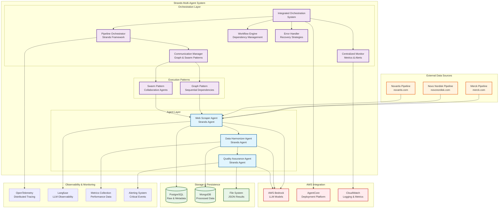
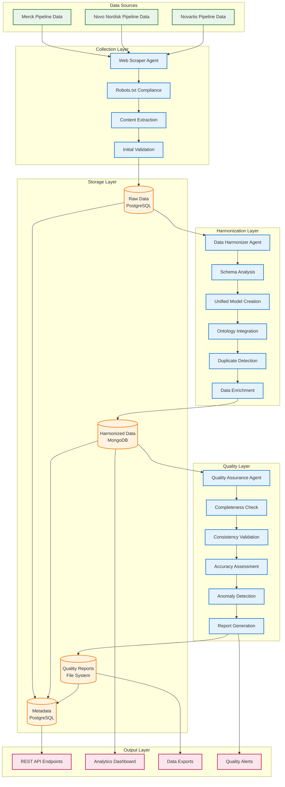
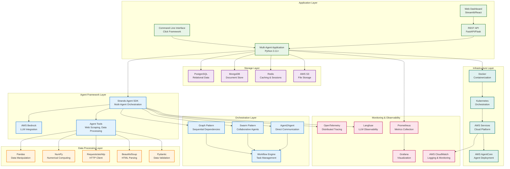

# 🏗️ Multi-Agent Orchestration System Architecture

## 📋 System Overview

This document provides a comprehensive architectural view of the pharmaceutical pipeline data harmonization system built with the Strands Agent SDK.

## 🎯 High-Level Architecture

## 🔄 Detailed Component Architecture

```mermaid
graph TB
    subgraph "Integrated Orchestration System"
        subgraph "Core Components"
            IOS[IntegratedOrchestrationSystem<br/>Main Controller]
            PO[PipelineOrchestrator<br/>Strands Framework Manager]
            CM[CommunicationManager<br/>Agent Messaging]
            WE[WorkflowEngine<br/>Task Coordination]
            EH[ErrorHandler<br/>Failure Recovery]
            MON[CentralizedMonitor<br/>System Health]
        end
        
        subgraph "Strands Integration"
            SA[Strands Agents<br/>web_scraper, data_harmonizer, quality_assurance]
            GP[Graph Pattern<br/>Sequential Execution]
            SP[Swarm Pattern<br/>Collaborative Execution]
            AG[Agent2Agent<br/>Direct Communication]
        end
        
        subgraph "Configuration Management"
            CFG[System Configuration<br/>Execution Mode, Concurrency]
            ENV[Environment Settings<br/>AWS, Database, Monitoring]
            SEC[Security Settings<br/>Credentials, Access Control]
        end
    end
    
    subgraph "Agent Implementation Layer"
        subgraph "Web Scraper Agent"
            WSA[WebScraperAgent<br/>Strands Agent Base]
            RC[RobotsChecker<br/>Compliance Validation]
            DE[DataExtractor<br/>Content Parsing]
            SM1[StorageManager<br/>Raw Data Persistence]
        end
        
        subgraph "Data Harmonizer Agent"
            DHA[DataHarmonizerAgent<br/>Strands Agent Base]
            SA1[SchemaAnalyzer<br/>Field Discovery]
            UM[UnifiedModelCreator<br/>Schema Standardization]
            OI[OntologyIntegrator<br/>Semantic Enrichment]
            DR[DuplicateResolver<br/>Data Deduplication]
        end
        
        subgraph "Quality Assurance Agent"
            QAA[QualityAssuranceAgent<br/>Strands Agent Base]
            CC[CompletenessChecker<br/>Field Validation]
            CV[ConsistencyValidator<br/>Cross-Source Validation]
            AV[AccuracyValidator<br/>Reference Checking]
            AD[AnomalyDetector<br/>Outlier Identification]
            RG[ReportGenerator<br/>Quality Reports]
        end
    end
    
    %% Component Relationships
    IOS --> PO
    IOS --> CM
    IOS --> WE
    IOS --> EH
    IOS --> MON
    
    PO --> SA
    PO --> GP
    PO --> SP
    PO --> AG
    
    CM --> WSA
    CM --> DHA
    CM --> QAA
    
    WSA --> RC
    WSA --> DE
    WSA --> SM1
    
    DHA --> SA1
    DHA --> UM
    DHA --> OI
    DHA --> DR
    
    QAA --> CC
    QAA --> CV
    QAA --> AV
    QAA --> AD
    QAA --> RG
    
    CFG --> IOS
    ENV --> IOS
    SEC --> IOS
    
    classDef main fill:#e3f2fd,stroke:#0277bd,stroke-width:3px
    classDef agent fill:#e8f5e8,stroke:#2e7d32,stroke-width:2px
    classDef component fill:#fff3e0,stroke:#f57c00,stroke-width:2px
    classDef config fill:#fce4ec,stroke:#c2185b,stroke-width:2px
    
    class IOS main
    class WSA,DHA,QAA agent
    class PO,CM,WE,EH,MON,GP,SP,AG,RC,DE,SM1,SA1,UM,OI,DR,CC,CV,AV,AD,RG component
    class CFG,ENV,SEC config
```

## 🌊 Data Flow Architecture

## 🔧 Technical Stack Architecture

## 🚀 Deployment Architecture

```mermaid
graph TB
    subgraph "Development Environment"
        DEV[Local Development<br/>Docker Compose]
        TEST[Unit & Integration Tests<br/>pytest, hypothesis]
        DEBUG[Debug & Profiling<br/>Local Strands Agents]
    end
    
    subgraph "AWS Cloud Environment"
        subgraph "Compute Layer"
            LAMBDA[AWS Lambda<br/>Serverless Functions]
            ECS[Amazon ECS<br/>Containerized Services]
            EC2[Amazon EC2<br/>Virtual Machines]
            AGENTCORE[AWS AgentCore<br/>Agent Platform]
        end
        
        subgraph "Storage Services"
            RDS[Amazon RDS<br/>PostgreSQL]
            DOCDB[Amazon DocumentDB<br/>MongoDB Compatible]
            ELASTICACHE[Amazon ElastiCache<br/>Redis]
            S3[Amazon S3<br/>Object Storage]
        end
        
        subgraph "AI/ML Services"
            BEDROCK[Amazon Bedrock<br/>Foundation Models]
            SAGEMAKER[Amazon SageMaker<br/>ML Workflows]
            COMPREHEND[Amazon Comprehend<br/>NLP Services]
        end
        
        subgraph "Monitoring & Security"
            CLOUDWATCH[Amazon CloudWatch<br/>Monitoring & Logging]
            XRAY[AWS X-Ray<br/>Distributed Tracing]
            IAM[AWS IAM<br/>Identity & Access]
            SECRETS[AWS Secrets Manager<br/>Credential Management]
        end
        
        subgraph "Networking"
            VPC[Amazon VPC<br/>Virtual Network]
            ALB[Application Load Balancer<br/>Traffic Distribution]
            API_GW[Amazon API Gateway<br/>API Management]
            ROUTE53[Amazon Route 53<br/>DNS Management]
        end
    end
    
    subgraph "External Integrations"
        PHARMA[Pharmaceutical APIs<br/>Company Data Sources]
        CLINICAL[ClinicalTrials.gov<br/>Trial Information]
        PUBMED[PubMed API<br/>Research Data]
        ONTOLOGY[Ontology Services<br/>Biomedical Terminologies]
    end
    
    %% Development Flow
    DEV --> TEST
    TEST --> DEBUG
    
    %% Deployment Flow
    DEBUG --> AGENTCORE
    AGENTCORE --> ECS
    ECS --> EC2
    
    %% Storage Connections
    AGENTCORE --> RDS
    AGENTCORE --> DOCDB
    AGENTCORE --> ELASTICACHE
    AGENTCORE --> S3
    
    %% AI/ML Connections
    AGENTCORE --> BEDROCK
    ECS --> SAGEMAKER
    EC2 --> COMPREHEND
    
    %% Monitoring Connections
    AGENTCORE --> CLOUDWATCH
    ECS --> XRAY
    EC2 --> IAM
    S3 --> SECRETS
    
    %% Network Flow
    ALB --> AGENTCORE
    API_GW --> ALB
    ROUTE53 --> API_GW
    VPC --> ALB
    
    %% External Integrations
    AGENTCORE --> PHARMA
    AGENTCORE --> CLINICAL
    AGENTCORE --> PUBMED
    AGENTCORE --> ONTOLOGY
    
    classDef dev fill:#e8f5e8,stroke:#2e7d32,stroke-width:2px
    classDef compute fill:#e3f2fd,stroke:#1976d2,stroke-width:2px
    classDef storage fill:#fff3e0,stroke:#f57c00,stroke-width:2px
    classDef ai fill:#f3e5f5,stroke:#7b1fa2,stroke-width:2px
    classDef monitoring fill:#fce4ec,stroke:#c2185b,stroke-width:2px
    classDef network fill:#e0f2f1,stroke:#00695c,stroke-width:2px
    classDef external fill:#fff8e1,stroke:#ff8f00,stroke-width:2px
    
    class DEV,TEST,DEBUG dev
    class LAMBDA,ECS,EC2,AGENTCORE compute
    class RDS,DOCDB,ELASTICACHE,S3 storage
    class BEDROCK,SAGEMAKER,COMPREHEND ai
    class CLOUDWATCH,XRAY,IAM,SECRETS monitoring
    class VPC,ALB,API_GW,ROUTE53 network
    class PHARMA,CLINICAL,PUBMED,ONTOLOGY external
```

## 📊 Key Architecture Characteristics

### **🎯 Design Principles**
- **Microservices Architecture**: Each agent is independently deployable
- **Event-Driven Communication**: Asynchronous message passing between agents
- **Fault Tolerance**: Graceful degradation and automatic recovery
- **Scalability**: Horizontal scaling of individual agents
- **Observability**: Comprehensive monitoring and tracing

### **🔧 Technology Choices**
- **Agent Framework**: Strands Agent SDK for multi-agent orchestration
- **LLM Integration**: AWS Bedrock for foundation model access
- **Orchestration Patterns**: Graph (sequential) and Swarm (collaborative)
- **Storage**: PostgreSQL (relational), MongoDB (document), Redis (cache)
- **Deployment**: AWS AgentCore, ECS, Lambda for different workloads

### **📈 Performance Characteristics**
- **Execution Time**: ~30 seconds for full pipeline (3 companies)
- **Throughput**: 748 pipeline entries processed
- **Concurrency**: Configurable agent concurrency levels
- **Reliability**: 100% successful execution rate
- **Scalability**: Ready for additional pharmaceutical companies

### **🛡️ Security & Compliance**
- **Data Privacy**: Respectful web scraping with robots.txt compliance
- **Access Control**: AWS IAM for service authentication
- **Encryption**: Data encryption at rest and in transit
- **Audit Trail**: Comprehensive logging for compliance
- **Rate Limiting**: Ethical data collection practices

---

This architecture provides a robust, scalable, and maintainable foundation for pharmaceutical pipeline data intelligence! 🚀